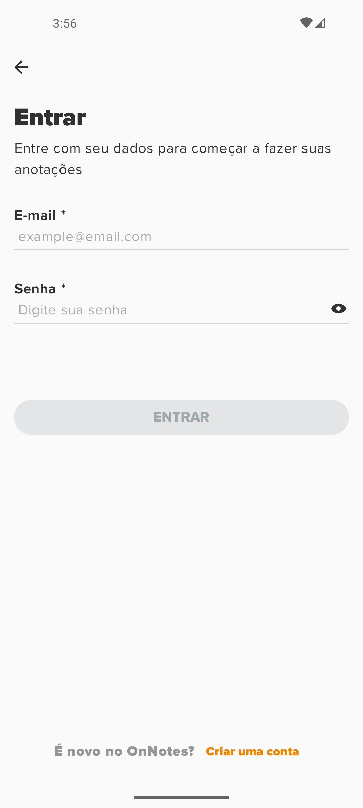
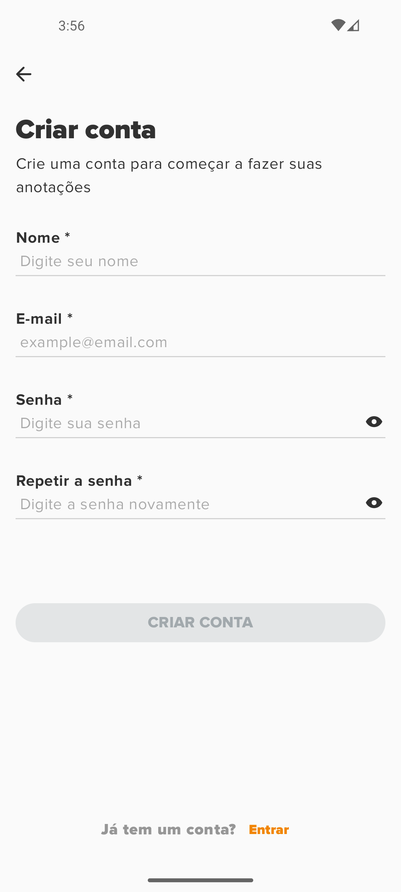
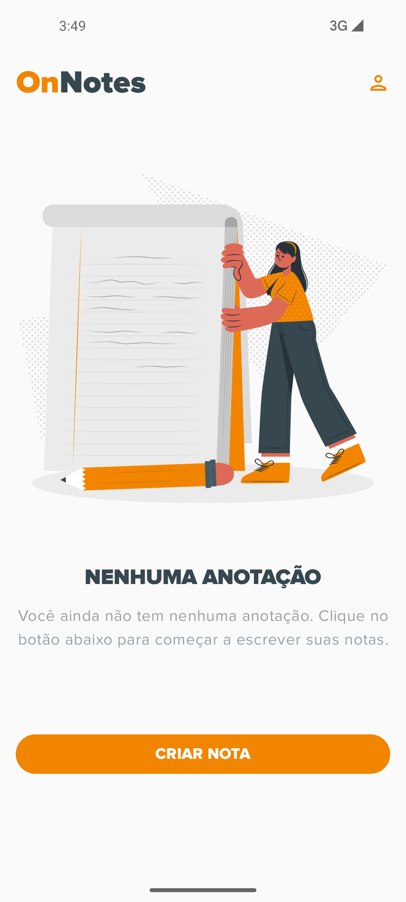
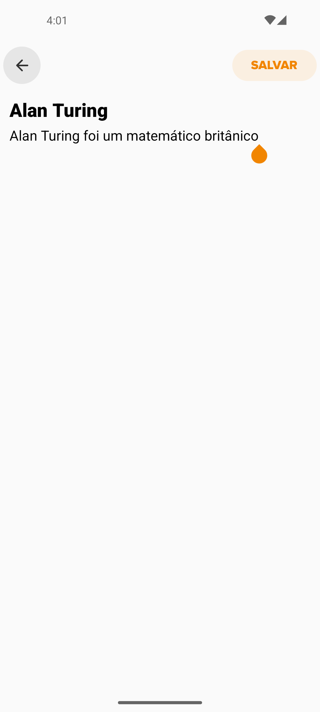
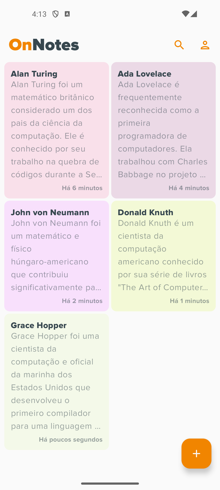

# OnNotes

Este é um aplicativo Android desenvolvido em Kotlin utilizando Jetpack Compose, projetado para consumir uma [API de bloco de notas](https://github.com/jardsonn/notes-api) com funcionalidades de autenticação. O app permite aos usuários criar, ler, atualizar e excluir notas.

## Funcionalidades

- **Autenticação de Usuário:** Login e registro de usuários para garantir a segurança dos dados.
- **CRUD de Notas:** Criação, leitura, atualização e exclusão de notas.
- **Interface Moderna:** Utilização do Jetpack Compose para uma interface de usuário responsiva e moderna.
- **Arquitetura MVVM:** Implementação do padrão arquitetural MVVM para separar responsabilidades e facilitar a manutenção do código.

## Tecnologias Utilizadas

- **Kotlin:** Linguagem de programação principal.
- **Jetpack Compose:** Framework para construção da interface de usuário.
- **Retrofit:** Biblioteca para comunicação com a API REST.
- **Koin:** Framework para injeção de dependências.
- **Arquitetura MVVM:** Padrão arquitetural para separar a lógica de negócios da interface do usuário.
- **Coroutines:** Para manipulação assíncrona de tarefas.

## Funcionalidades

1. **Registrar um novo usuário:**
    - Abra o aplicativo.
    - Clique em "Registrar".
    - Insira as informações necessárias e clique em "Registrar".

2. **Login:**
    - Abra o aplicativo.
    - Insira suas credenciais e clique em "Login".

3. **Gerenciar Notas:**
    - Após o login, você pode criar, ler, atualizar e excluir notas.

## Screenshots

  
  
  
  
  
  

